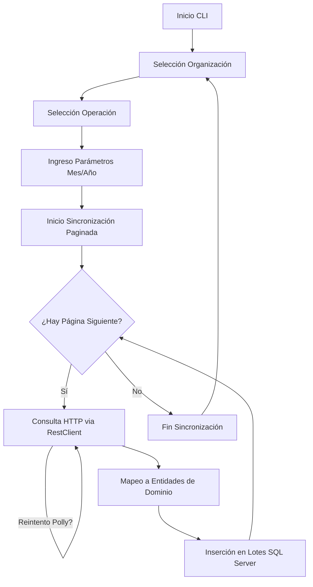

# HGT EAM Client - Conector de Servicios Web

Este proyecto es una aplicación de consola desarrollada en **.NET 9** diseñada para sincronizar datos entre servicios web de **Infor EAM** y una base de datos local **SQL Server**. El sistema actúa como un "conector" robusto, gestionando la extracción de datos paginados, la resiliencia en las comunicaciones y la persistencia atómica.

## Características Principales

- **Sincronización Paginada**: Implementa un flujo de consulta recursiva para manejar grandes volúmenes de datos mediante paginación.
- **Resiliencia HTTP**: Utiliza **Polly** para gestionar reintentos automáticos con retroceso exponencial ante errores transitorios (429 Too Many Requests, 5xx, timeouts).
- **Persistencia por Lotes (Batching)**: Inserta registros en la base de datos local en bloques configurables (por defecto 500) para optimizar el rendimiento y la memoria.
- **Multiorganización**: Capacidad de gestionar credenciales y consultas para múltiples organizaciones configuradas en un único archivo.
- **Logging Exhaustivo**: Integración con **Serilog** para registro detallado en consola y archivos planos (opcionalmente en base de datos).

## Arquitectura del Conector

El proyecto sigue una arquitectura por capas simplificada para facilitar el mantenimiento y la extensibilidad:

### 1. Capa de Presentación (`Program.cs`)
Es el punto de entrada de la aplicación.
- Proporciona una **CLI interactiva** mediante menús animados en colores.
- Permite seleccionar la organización, el tipo de operación y los parámetros de fecha (Mes/Año).
- Gestiona el tiempo de vida de la aplicación y la inyección de dependencias mediante un `Bootstrapper`.

### 2. Capa de Aplicación (`Application/`)
Contiene la lógica de orquestación de la sincronización.
- **`BaseSyncService`**: Clase abstracta que define el esqueleto de sincronización (`FetchAndPersistAllAsync`). Implementa el flujo: *Consulta Página N* -> *Persistir Batch* -> *Siguiente Página*.
- **Servicios Concretos**: `ProvisionSyncService` y `PurchaseOrderAuditSyncService` implementan la lógica específica para cada entidad de EAM.

### 3. Capa de Dominio (`Domain/`)
Define el lenguaje común del sistema.
- **`Models/`**: Contiene las entidades POCO que mapean tanto con la respuesta JSON del servicio web como con las tablas de la base de datos.
- **DTOs de Consulta**: Objetos que transportan los parámetros necesarios para las peticiones a EAM.

### 4. Capa de Infraestructura (`Infrastructure/`)
Gestiona las comunicaciones externas y la persistencia.
- **`Http/RestClient.cs`**: Cliente HTTP personalizado que encapsula las cabeceras de autenticación y la política de reintentos de Polly.
- **`Data/`**: Utiliza **Entity Framework Core** para el acceso a datos. Implementa un `AppDbContextFactory` para manejar la creación de contextos de forma segura en aplicaciones de consola.
- **Configuración**: Modelos vinculados a `appsettings.json` para gestionar `ApiSettings`, `HttpRetry` y cadenas de conexión.

## Flujo de Trabajo del Conector



## Prerrequisitos

- **Runtime .NET 9.0**
- **SQL Server** (con permisos de creación de tablas si el usuario tiene `db_owner`)
- Acceso a las URLs de servicios web de Infor EAM.

## Configuración (`appsettings.json`)

El archivo de configuración principal incluye:

```json
{
  "ConnectionStrings": {
    "DefaultConnection": "Server=localhost;Database=EAM_Cache;Trusted_Connection=True;..."
  },
  "ApiSettings": {
    "BaseUrl": "https://eam-api.example.com/",
    "Credentials": {
      "ORG_NAME": {
        "ClientID": "...",
        "ClientSecret": "..."
      }
    }
  },
  "HttpRetry": {
    "MaxRetries": 5,
    "BaseDelayMilliseconds": 1000
  }
}
```
## Ejecución

1. Compile el proyecto: `dotnet build`
2. Ejecute la aplicación: `dotnet run` o ejecute el binario generado.
3. Siga las instrucciones en pantalla para iniciar la sincronización.
